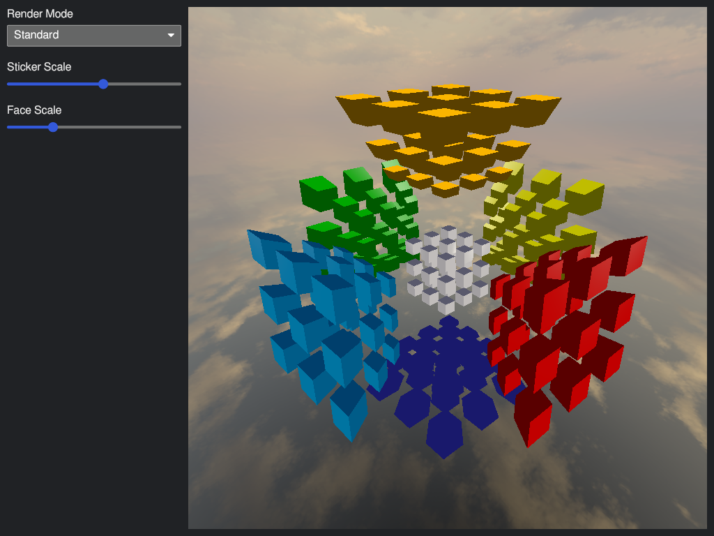

# Hypercube

A 4D Rubik's cube visualization built with Rust, iced, and wgpu.

## Features

- Interactive 4D hypercube rendering
- GPU-accelerated graphics with wgpu
- Adjustable sticker and face scaling
- Real-time 4D to 3D projection

## Usage

```bash
cargo run
```



# Notes

Skybox obtained from https://opengameart.org/content/cloudy-skyboxes-0, Public Domain (CC0), Copyright Screaming Brain Studios.

## License

Licensed under either of:
- Apache License, Version 2.0 ([LICENSE-APACHE](LICENSE-APACHE))
- MIT License ([LICENSE-MIT](LICENSE-MIT))

at your option.
