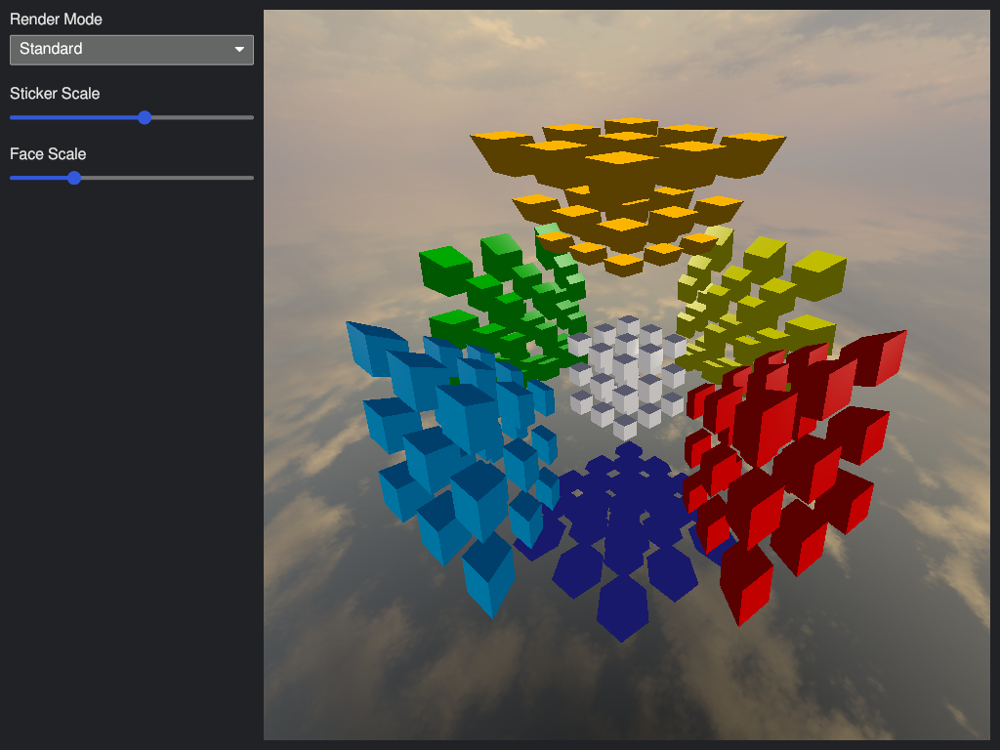

# Hypercube

A 4D Rubik's cube visualization built with Rust, iced, and wgpu.

## Features

- Interactive 4D hypercube rendering
- GPU-accelerated graphics with wgpu
- Adjustable sticker and face scaling
- Real-time 4D to 3D projection

## Usage

```bash
cargo run
```



# Notes

Skybox obtained from https://opengameart.org/content/cloudy-skyboxes-0, Public Domain (CC0), Copyright Screaming Brain Studios.

## License

Licensed under either of:
- Apache License, Version 2.0 ([LICENSE-APACHE](LICENSE-APACHE))
- MIT License ([LICENSE-MIT](LICENSE-MIT))

at your option.

The ice shader logic is licensed under [Creative Commons 4.0 Non-commercial (NC)](https://creativecommons.org/licenses/by-nc/4.0/legalcode) license. Original at https://www.shadertoy.com/view/MscXzn by Sébastien Bérubé.

The water shader logic is licensed under [Creative Commons Attribution-NonCommercial-ShareAlike 3.0 Unported License](https://creativecommons.org/licenses/by-nc-sa/3.0/legalcode.en). Original at https://www.shadertoy.com/view/Ms2SD1 by TDM.

The solver logic is derived from NdSolve.java in http://superliminal.com/cube/cube.htm. Its license is [LICENSE-MC4D](LICENSE-MC4D) from https://github.com/cutelyaware/magiccube4d/blob/master/LICENSE.md.